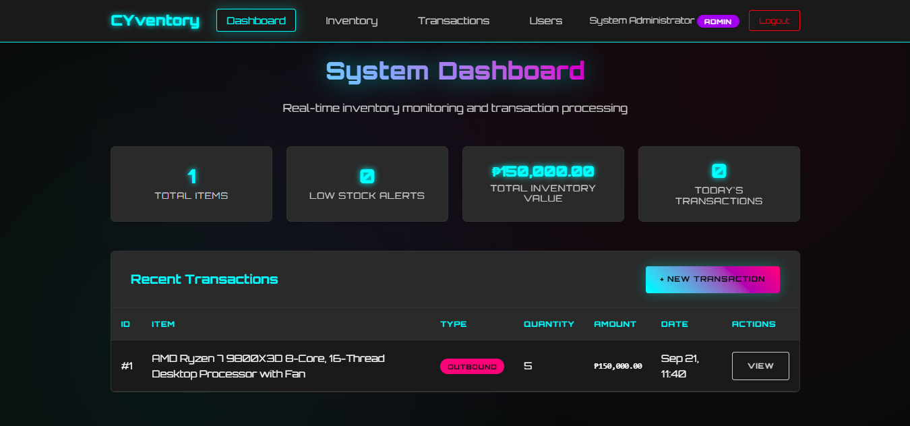
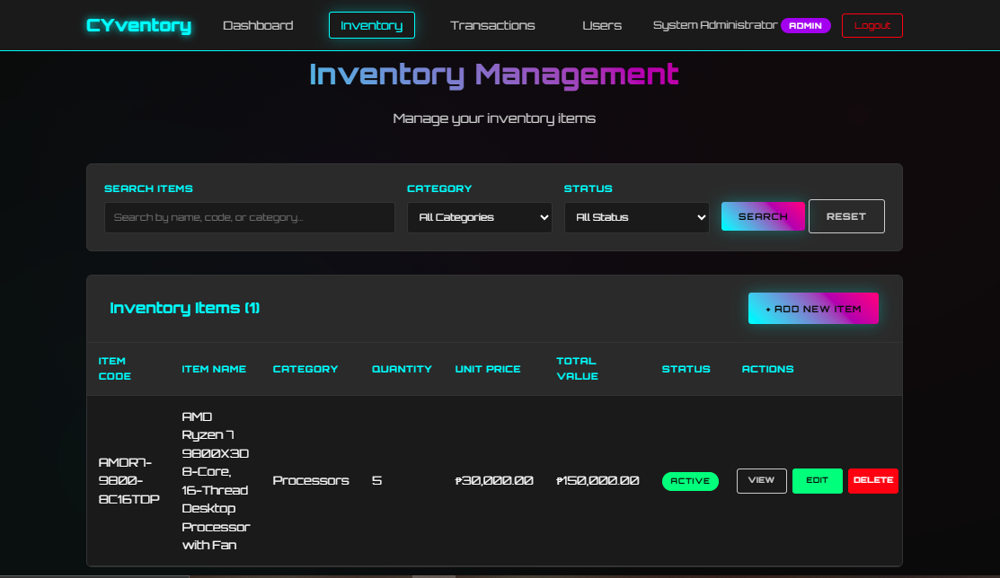
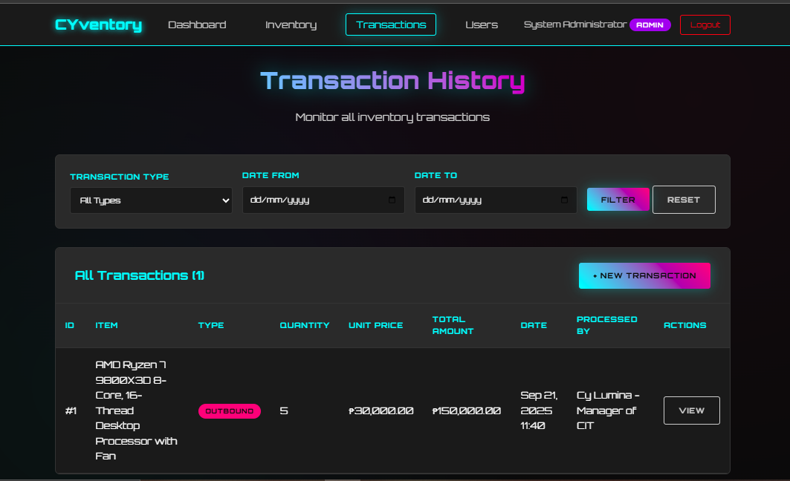
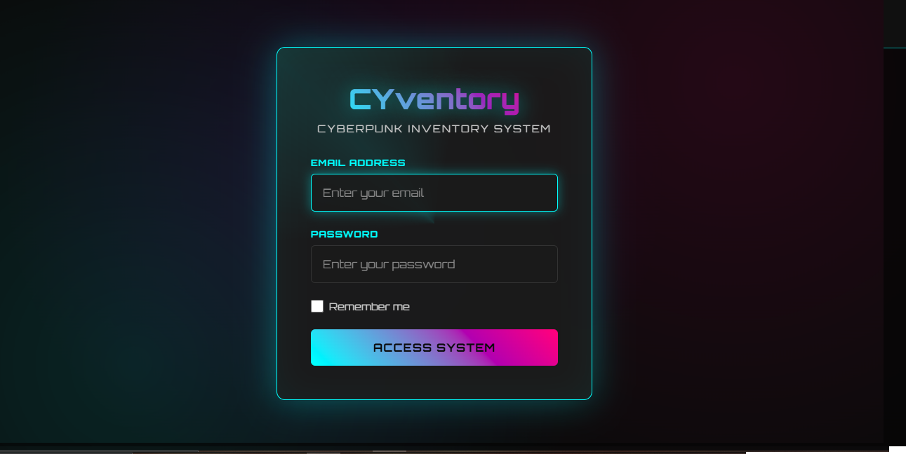

# CYventory - Cyberpunk Inventory Tracking System

## Description / Overview

CYventory is a Laravel-based inventory management system featuring a futuristic cyberpunk aesthetic with neon cyan and pink accents. The system provides comprehensive inventory tracking with real-time stock monitoring, low-stock alerts, and inbound/outbound transaction processing. Built with the Orbitron font and featuring glowing UI effects, the system utilizes SweetAlert2 for elegant confirmations and maintains a responsive design throughout.

## Objectives

- Develop a full-stack web application using Laravel framework
- Implement role-based access control (RBAC) with multiple user privilege levels
- Create a comprehensive inventory management system with transaction tracking
- Design and implement a modern, responsive user interface with cyberpunk aesthetics
- Apply CRUD operations for inventory items, transactions, and user management
- Integrate real-time calculations and automated inventory updates
- Demonstrate proficiency in Laravel's MVC architecture, Eloquent ORM, and Blade templating

## Features / Functionality

### Core Features
- **Dashboard**: Real-time statistics showing total items, low stock alerts, inventory value, and today's transactions
- **Inventory Management**: Complete CRUD operations for inventory items with categorization, pricing, and stock levels
- **Transaction Processing**: Inbound (stock in/purchase/return) and outbound (stock out/sale/issue) transaction handling
- **User Management**: Admin-controlled user creation, editing, and role assignment
- **Low Stock Alerts**: Automated monitoring and warnings when items reach reorder levels
- **Search & Filter**: Advanced filtering by category, status, transaction type, and date ranges

### User Roles & Permissions
- **Admin**: Full system access including user management, inventory control, and all transactions
- **Manager**: Inventory and transaction management without user administration privileges
- **Staff**: Read-only access to view inventory and transaction history

### UI/UX Features
- Cyberpunk-themed interface with neon glowing effects
- SweetAlert2 integration for elegant confirmations and notifications
- Responsive design for desktop and mobile devices
- Real-time form validation and calculations
- Transaction summary previews before processing

## Installation Instructions

### Prerequisites
- PHP >= 8.1
- Composer
- MySQL/MariaDB
- Node.js & NPM (for asset compilation)

### Setup Steps

1. **Clone the repository**
```bash
   git clone https://github.com/ZruVish/CYventory---Inventory-Tracking-Processing-System
   cd CYventory---Inventory-Tracking-Processing-System
```

2. **Install PHP dependencies**
```bash
   composer install
```

3. **Install Node dependencies**
```bash
   npm install
```

4. **Create environment file**
```bash
   cp .env.example .env
```

5. **Configure database in `.env`**
```env
   DB_CONNECTION=mysql
   DB_HOST=127.0.0.1
   DB_PORT=3306
   DB_DATABASE=inventory_tracking_processing_system
   DB_USERNAME=root
   DB_PASSWORD=
```

6. **Generate application key**
```bash
   php artisan key:generate
```

7. **Run migrations**
```bash
   php artisan migrate
```

8. **Seed default users**
```bash
   php artisan db:seed
```

9. **Build assets**
```bash
   npm run build
```

10. **Start development server**
```bash
    php artisan serve
```

11. **Access the application**
    - URL: `http://localhost:8000`

### Default Login Credentials

After seeding, you can login with:

| Role | Email | Password |
|------|-------|----------|
| Admin | admin@cyventory.com | admin123 |
| Manager | manager@cyventory.com | manager123 |
| Staff | staff@cyventory.com | staff123 |

## Usage

### Adding Inventory Items

1. Navigate to **Inventory** → **Add New Item**
2. Fill in the required fields:
   - Item Code (unique identifier)
   - Item Name
   - Category (Processors, Interfaces, Displays, etc.)
   - Initial Quantity
   - Unit Price
   - Reorder Level
3. Click **Save Item**

### Processing Transactions

1. Go to **Transactions** → **New Transaction**
2. Select the inventory item from the dropdown
3. Choose transaction type:
   - **Inbound**: Stock arriving (purchases, returns)
   - **Outbound**: Stock leaving (sales, issues)
4. Enter quantity and verify unit price
5. Add reference number and notes (optional)
6. Review the transaction summary
7. Click **Process Transaction**

### Managing Users (Admin Only)

1. Access **Users** from the navigation menu
2. Click **Add New User**
3. Enter user details and assign role
4. Set account status (Active/Inactive)
5. Click **Create User**

### Monitoring Low Stock

- Low stock items are automatically highlighted on the dashboard
- View all low stock alerts in the dedicated section
- Click **Restock** to quickly create an inbound transaction

## Screenshots or Code Snippets

### Dashboard Overview


### Inventory Management


### Transaction Processing


### Login Screen


### Transaction Processing
```php
public function store(Request $request)
{
    $validated = $request->validate([
        'inventory_id' => 'required|exists:inventories,id',
        'transaction_type' => 'required|in:inbound,outbound',
        'quantity' => 'required|integer|min:1',
        'unit_price' => 'required|numeric|min:0',
        'reference_number' => 'nullable|string|max:255',
        'notes' => 'nullable|string',
        'processed_by' => 'required|string|max:255',
    ]);

    DB::transaction(function () use ($validated) {
        $inventory = Inventory::findOrFail($validated['inventory_id']);
        
        // Update inventory quantity
        if ($validated['transaction_type'] === 'inbound') {
            $inventory->quantity += $validated['quantity'];
        } else {
            $inventory->quantity -= $validated['quantity'];
        }
        
        $inventory->save();

        // Create transaction record
        Transaction::create([
            'inventory_id' => $validated['inventory_id'],
            'transaction_type' => $validated['transaction_type'],
            'quantity' => $validated['quantity'],
            'unit_price' => $validated['unit_price'],
            'total_amount' => $validated['quantity'] * $validated['unit_price'],
            'reference_number' => $validated['reference_number'],
            'notes' => $validated['notes'],
            'processed_by' => $validated['processed_by'],
            'processed_at' => now(),
        ]);
    });

    return redirect()->route('transactions.index')
        ->with('success', 'Transaction processed successfully!');
}
```

### Cyberpunk Styling
```css
:root {
    --neon-cyan: #00ffff;
    --neon-pink: #ff0080;
    --neon-purple: #8a2be2;
    --dark-bg: #0a0a0a;
    --dark-surface: #1a1a1a;
    --dark-card: #2a2a2a;
}

.page-title {
    font-size: 2.5rem;
    font-weight: 900;
    background: linear-gradient(45deg, var(--neon-cyan), var(--neon-pink));
    -webkit-background-clip: text;
    -webkit-text-fill-color: transparent;
    background-clip: text;
    animation: titleGlow 2s ease-in-out infinite alternate;
}
```

### Role-Based Authorization
```php
// User Model - Permission Methods
public function canManageInventory()
{
    return in_array($this->role, ['admin', 'manager']);
}

public function canManageUsers()
{
    return $this->role === 'admin';
}

public function canCreateTransactions()
{
    return $this->is_active && in_array($this->role, ['admin', 'manager']);
}
```

## Contributors

- **Carl Amir Mostera Flores** - Developer & Designer

## License

This project is licensed under the MIT License - see below for details:
```
MIT License

Copyright (c) 2025 [ZruVish]

Permission is hereby granted, free of charge, to any person obtaining a copy
of this software and associated documentation files (the "Software"), to deal
in the Software without restriction, including without limitation the rights
to use, copy, modify, merge, publish, distribute, sublicense, and/or sell
copies of the Software, and to permit persons to whom the Software is
furnished to do so, subject to the following conditions:

The above copyright notice and this permission notice shall be included in all
copies or substantial portions of the Software.

THE SOFTWARE IS PROVIDED "AS IS", WITHOUT WARRANTY OF ANY KIND, EXPRESS OR
IMPLIED, INCLUDING BUT NOT LIMITED TO THE WARRANTIES OF MERCHANTABILITY,
FITNESS FOR A PARTICULAR PURPOSE AND NONINFRINGEMENT. IN NO EVENT SHALL THE
AUTHORS OR COPYRIGHT HOLDERS BE LIABLE FOR ANY CLAIM, DAMAGES OR OTHER
LIABILITY, WHETHER IN AN ACTION OF CONTRACT, TORT OR OTHERWISE, ARISING FROM,
OUT OF OR IN CONNECTION WITH THE SOFTWARE OR THE USE OR OTHER DEALINGS IN THE
SOFTWARE.
```

---
